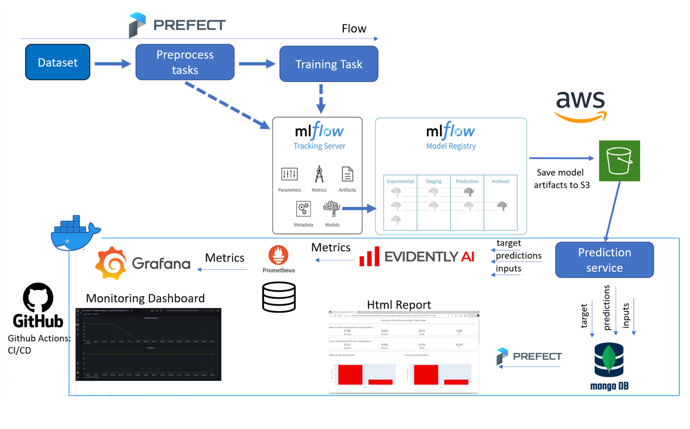

# mlops
This repo is used to demostrate MLOps best practices leverating ML pipelines, model registries, experiment tracking, monitoring toolkits and CI/CD.

# Data

* Data Set Characteristics: Multivariate
* Number of Instances: 1567
* Area: Computer
* Attribute Characteristics: Real
* Number of Attributes: 10
* Date Donated: 2008-11-19
* Associated Tasks: Classification, Causal-Discovery
* Missing Values? Yes

# Architecture

# ML Pipeline
TBA

# Experiment Tracking
TBA

# Model Registry
TBA

# CI/CD
TBA

